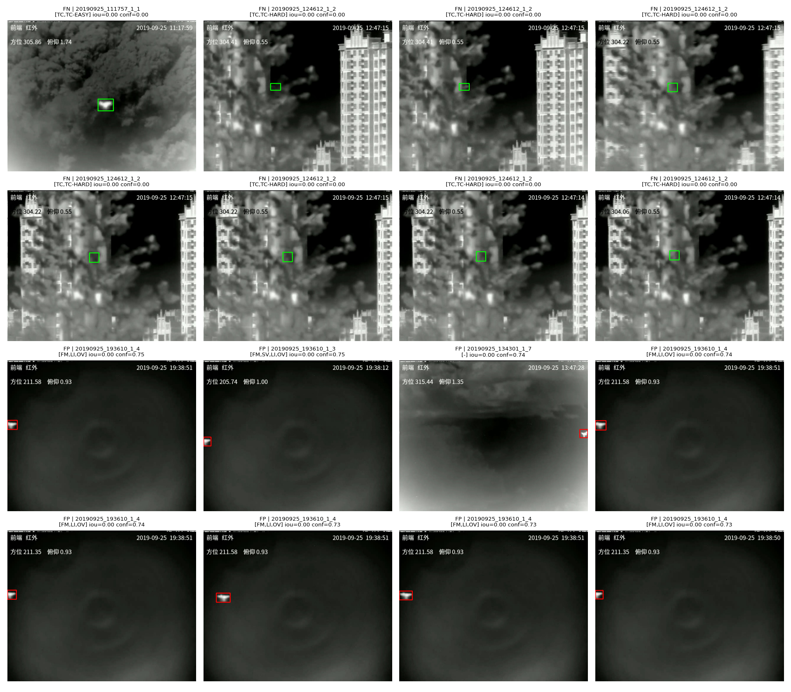

# Anti-UAV RGBT: real-time detection and tracking

Detection and tracking of drones in infrared video: a fine-tuned YOLO11s
detector with ByteTrack, an attribute-driven failure analysis, and a browser prototype that runs
the model on-device.

## Prototype: live drone tracking in the browser (works on iPhone)

This is a working prototype, not a production-ready system. The "Intentionally unoptimized
baseline" section below lists exactly what is still missing.

Demo video: https://drive.google.com/drive/folders/1oOzKJ20MehNSpWIXmN61-6g8Veac3kq0

The fine-tuned detector runs entirely client-side in the browser, with no inference server
involved. Point an iPhone camera at a screen playing infrared drone footage.

- The model is exported to ONNX with NMS baked directly into the graph
  (`notebooks/06_onnx_export.ipynb`), so the browser only does box-coordinate math. There is no
  NMS or IoU code on the JS side.
- It runs on [ONNX Runtime Web](https://onnxruntime.ai/docs/tutorials/web/): WebGPU with a WASM
  fallback, picked automatically at load time.
- Letterbox preprocessing matches the training `imgsz`. The FPS counter on screen reports a
  measured number rather than a spec-sheet claim.
- Measured at about 24 FPS on an M1 Pro desktop through the WebGPU backend, and confirmed
  working live on an actual iPhone (Safari, rear camera, over a tunnel) with stable tracking.
- Full technical write-up and run instructions: [`web/README-web.md`](web/README-web.md).

### Intentionally unoptimized baseline

This was the fastest route to something that works end to end, not to something that works well:

- Full `imgsz=640`, with no INT8 quantization or resolution tuning yet.
- No tracker in the browser. Every frame is an independent detection with no persistent track
  IDs, unlike the Python-side ByteTrack integration described below.
- Training only ever touched infrared, so pointing a live RGB daylight camera at the sky finds
  nothing. That is by design (see Known limitations).
- A browser page rather than a native app, so there is no CoreML or Apple Neural Engine
  acceleration yet.
- A 38MB ONNX model served as a static file, without a CDN or edge caching.

### What comes next

Concrete next steps, roughly in the order I would tackle them:

1. INT8 quantization plus an accuracy/speed tradeoff benchmark
   (`model.export(..., quantize=8)`). The easiest win available before touching input resolution.
2. A native iOS app via CoreML and the Apple Neural Engine, to measure the real ANE speedup over
   WebGPU and WASM. Probably the largest single lever for genuinely real-time inference
   on-device.
3. A lightweight tracker in JS (IoU plus Kalman, or a ByteTrack port) so detections persist as
   tracked objects with stable IDs across frames, matching the Python-side pipeline instead of
   detecting independently on every frame.
4. Fine-tuning on the dataset's visible/RGB modality, which is present in Anti-UAV-RGBT but
   currently unused, to support ordinary daylight cameras.
5. PWA packaging with offline model caching through a service worker, for an installable and
   more resilient mobile experience.
6. A server-assisted hybrid fallback that streams to a GPU backend over WebSocket when the
   on-device model is too slow for the hardware, and falls back to on-device otherwise.

---

## Problem statement

Detect and track small, low-contrast aerial targets (drones) in infrared video under motion
blur, thermal crossover with the background, and occlusion, with an eye toward edge-oriented
deployment rather than a purely offline benchmark exercise. Built on the
[Anti-UAV-RGBT](https://github.com/ZhaoJ9014/Anti-UAV) benchmark dataset.

## Dataset and EDA

Source video runs at 25 FPS, so adjacent frames are near duplicates. `framecut.py` uses an
adaptive per-video stride, chosen from the median IoU between frame `t` and `t+N` against the GT
annotations, which shrinks the dataset without losing informative frames.

| Metric | Value |
| --- | --- |
| Train sequences | 160 (official split) |
| Source frames | 149,528 |
| Frames after subsampling | ~15,800 (10.6%) |
| Negative frames (no target) | 1,160 → 6.8% |
| Stride (min / median / max) | 5 / 10 / 50 |
| Median IoU (p10 / p50 / p90) | 0.01 / 0.17 / 0.32 |

`src/dataset.py` converts the sampled frames into a YOLO-format detection dataset (images,
labels, and `data.yaml`). See `notebooks/01_eda.ipynb`.

## Detection model: training and a data leakage bug

The first fine-tune was YOLO11s, 30 epochs, Adam. Validation metrics looked excellent, but
inspecting real footage showed the detector badly missing drones whenever any background was
present; it only worked cleanly on near-empty backgrounds. The cause is called out in the
dataset's own documentation: the original train/val split leaks data. Clips from the same
recording session (same background, same drone, same trajectory) end up on both sides of the
split, so validation metrics were measuring memorization rather than generalization.

`src/resplit_by_session.py` fixes this by regrouping every sequence by its recording session
(`YYYYMMDD_HHMMSS_N`) and assigning each session wholly to train or val, so no session appears in
both. The retrain ran on Kaggle with tuned hyperparameters: Adam replaced by SGD (better suited
to small objects), a 100-epoch budget with 15-epoch early-stop patience, and mosaic/mixup
augmentation for small-object and cloud-background robustness.

| Run | Precision | Recall | mAP50 | mAP50-95 | Note |
| --- | --- | --- | --- | --- | --- |
| Initial (30 epochs, Adam, leaky split) | 0.991 | 0.977 | 0.982 | 0.587 | Best numbers on paper, visibly worse in practice |
| Retrained (SGD, session-disjoint split) | 0.978 | 0.927 | 0.962 | 0.509 | Lower numbers, but trustworthy. Held-out test performance is in the failure analysis below |

Full per-epoch logs: `notebooks/02_train.ipynb` (initial run), `notebooks/03_opt_train.ipynb`
(retrain).

## Tracking (ByteTrack) and metrics

The retrained detector feeds [ByteTrack](https://arxiv.org/abs/2110.06864) (through Ultralytics'
`model.track(...)`) for identity persistence across frames. Evaluation used a held-out test
sequence, `motmetrics`, and the official Anti-UAV state-accuracy (mSA) formula:

| Metric | Value |
| --- | --- |
| MOTA | 0.933 |
| IDF1 | 0.730 |
| ID switches | 10 |
| mSA (single sequence) | 74.4% |

Demo video with tracked boxes: `assets/20190926_134054_1_1_infrared_tracked.mp4`. See
`notebooks/04_tracker.ipynb`.

## Failure analysis

Detection ran over the full test split (15,946 sampled frames across 91 sequences), with
outcomes grouped by the dataset's official challenge attributes (`label_new/`: `FM`, `LI`, `LR`,
`OC`, `OV`, `SV`, `TC`).

Overall: precision 98.8%, recall 87.3%, mean IoU 68.1%.

This is almost entirely a recall problem rather than a hallucination problem. Precision stays
between 93.9% and 99.3% across every attribute, with only 152 false positives out of 15,946
frames (about 1%). Of those false positives, 139 out of 152 (91.4%) come from `OV`-tagged
(out-of-view) sequences. The gallery below confirms visually that these are the drone entering
or leaving frame at the label's visibility boundary, not random false alarms on background
clutter.

The two measurably worst attributes are `SV` (scale variation, recall 5.3pp below overall) and
`TC` (thermal crossover, 5.1pp below). Both also have the lowest mean IoU (63.1% and 64.0%), so
even successful detections are localized less precisely. My hypotheses: with `SV`, rapid scale
change pushes the target outside the range the detector learned confidently; with `TC`, the
target's thermal signature blends into the background, which is a sensor-level limit rather than
an architecture gap.

Counter-intuitively, `LR`, `OC`, `OV` and `LI` all show higher recall than the overall baseline.
The likely reason is that `label_new` tags are sequence-level rather than frame-level: a sequence
tagged `OC` may contain only a few genuinely occluded frames among hundreds of easy ones, which
dilutes the metric.



Full test-set mSA across all 91 sequences, using the official penalized state-accuracy formula,
is 63.6%. But I cannot compare it with Published Protocol-I (zero-shot SOT) baselines from the Anti-UAV paper
(arXiv:2101.08466, Table IV) because the published trackers are evaluated zero-shot (Protocol
I, no training on Anti-UAV, initialized from a first-frame box), while this project trains on
Anti-UAV (Protocol II) and runs per-frame detection rather than classic single-object tracking.
The gap follows from that difference in setup and is not by itself evidence of a better method.

Full breakdown, per-attribute table, and worst-sequence ranking:
`notebooks/05_failure_analysis.ipynb`.

## Known limitations

- The train/val leakage fix works at the session level (`resplit_by_session.py`), but nobody has
  independently re-audited it beyond that regrouping.
- `label_new` challenge attributes are sequence-level rather than frame-level, which caps how
  precisely the failure analysis can attribute individual frame failures to a specific condition
  (see above). The `FM` and `SV` per-frame proxies computed from `gt_rect` deltas are
  approximate, because the detection-metric evaluation runs on stride-subsampled frames rather
  than truly adjacent ones. (The mSA evaluation above uses full, un-subsampled frames, so it is
  unaffected by this.)
- The detector is trained only on infrared frames, with no visible/RGB support (see the prototype
  limitations above).

## Repository structure

```
notebooks/         EDA, training, tracking, failure analysis, ONNX export (one notebook per stage)
src/               reusable modules: dataset building, session resplitting, failure-analysis metrics
web/               browser prototype: static page + exported ONNX model
assets/            demo video, failure-analysis gallery, cached metric CSVs
bytetrack/         ByteTrack tracker config
runs/              training run artifacts and trained weights (large binaries, gitignored)
Anti-UAV-RGBT/     dataset (gitignored, not part of this repo)
```